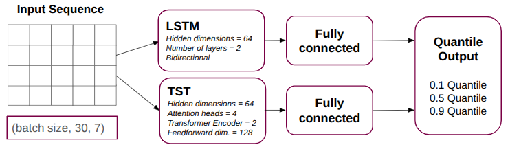
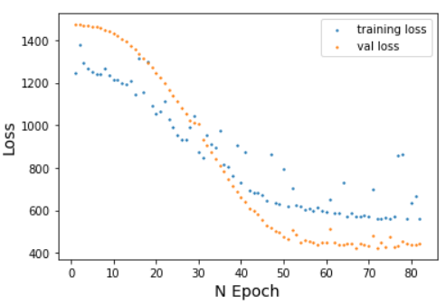
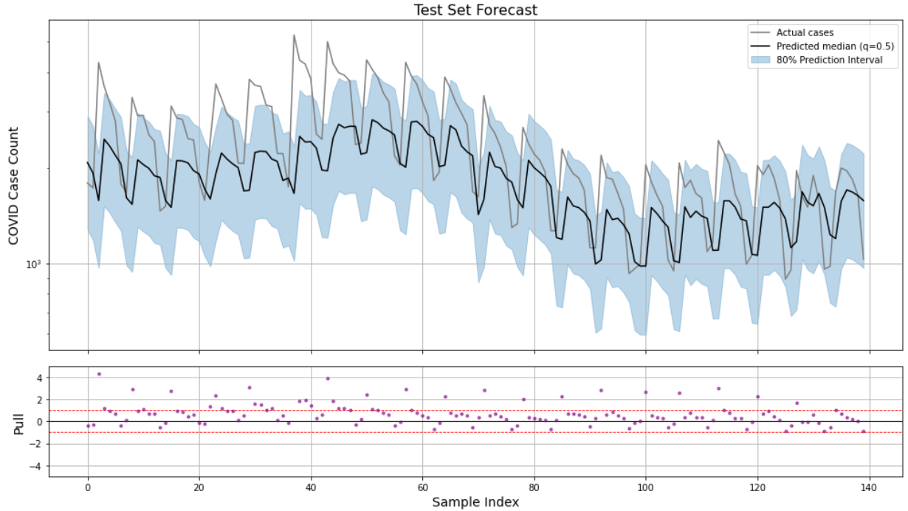
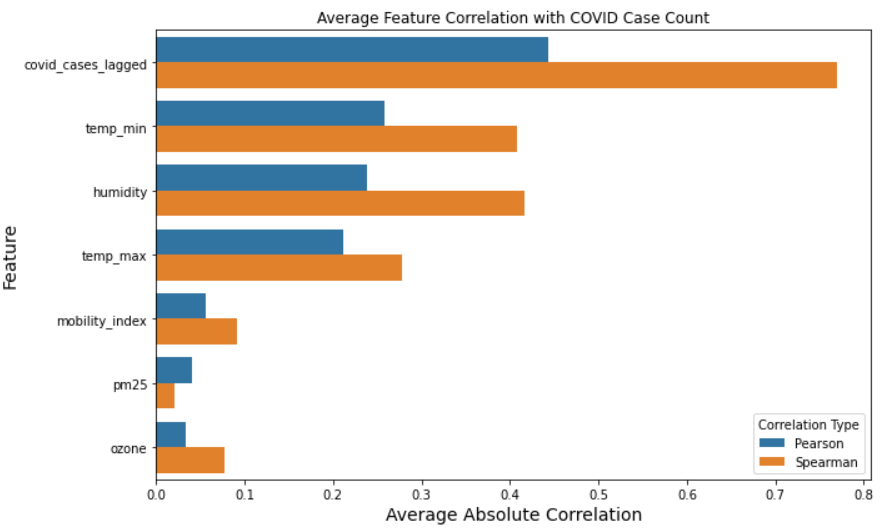

# Predicting Airborne Disease Spread Using Urban Mobility and Environmental Factors

> **Final Project – Machine Learning Course (2025)**  
> **Weizmann Institute of Science**

A deep learning framework for forecasting airborne disease spread by combining **urban mobility**, **environmental conditions**, and **historical epidemiological data**.

The project investigates whether incorporating mobility, weather, and air quality measurements improves short-term disease forecasting compared to relying solely on historical case counts. Instead of producing only a single prediction, the model performs **quantile regression**, providing both a forecast and an estimate of prediction uncertainty.

---

## Project Overview

Accurate forecasting of infectious diseases is essential for healthcare planning and public health decision making. Disease transmission is influenced by many interacting factors, including human movement, environmental conditions, and previous infection trends.

This project develops a multivariate time-series forecasting model that combines heterogeneous public datasets to predict the number of COVID-19 cases in **New York City** one day in advance.

Two deep learning architectures were explored:

- Long Short-Term Memory (LSTM)
- Time Series Transformer (TST)

Both models were trained using **quantile regression** to estimate the:

- 10th percentile
- Median (50th percentile)
- 90th percentile

of the next-day case count.

---

## Dataset

The model combines several publicly available datasets:

| Dataset | Features |
|----------|----------|
| Google Community Mobility Reports | Mobility Index |
| NYC Department of Health | Daily COVID-19 Cases |
| EPA Air Quality System | PM2.5 AQI, Ozone AQI |
| Open-Meteo Archive API | Maximum Temperature, Minimum Temperature, Relative Humidity |

The final dataset covers **New York City** between **February 2020 and October 2022**.

---

## Feature Engineering

The forecasting problem is formulated as supervised sequence prediction.

Each input sample contains the previous **30 days** of observations:

```
Day t-29
Day t-28
...
Day t
      ↓
Predict
      ↓
COVID cases on Day t+1
```

Input features:

- Mobility Index
- PM2.5 Air Quality Index
- Ozone Air Quality Index
- Maximum Temperature
- Minimum Temperature
- Relative Humidity
- Historical COVID-19 Case Count

Dataset split:

- **70%** Training
- **15%** Validation
- **15%** Test

---

## Model Architecture

Two neural network architectures were implemented and compared.

### Long Short-Term Memory (LSTM)

- 2 LSTM layers
- Hidden dimension: 64
- Fully connected output layer

### Time Series Transformer (TST)

- Transformer encoder architecture
- 4 attention heads
- 2 encoder layers
- Feed-forward dimension: 128

Both models output three quantiles simultaneously:

- q = 0.1
- q = 0.5
- q = 0.9

Training is performed using the **Pinball Loss**, allowing the model to learn prediction intervals instead of only point estimates.

---

## Training

Framework:

- PyTorch

Evaluation metrics:

- Pinball Loss
- Mean Absolute Error (MAE)
- R² Score

Training includes:

- Validation monitoring
- Model checkpointing
- Quantile prediction evaluation

---

## Results

The model successfully captures the temporal dynamics of COVID-19 case counts while estimating predictive uncertainty.

Key observations:

- Historical case counts remain the strongest predictor.
- Weather variables (temperature and humidity) contribute useful predictive information.
- Mobility and air quality provide complementary information for forecasting.
- The learned prediction intervals capture most of the observed variability.

The final **80% prediction interval** (between the 10th and 90th quantiles) covered approximately **75% of the test observations**, demonstrating reasonable uncertainty calibration.

---

## Repository Structure

```
Predicting-Airborne-Disease-Spread-Using-Urban-Mobility-and-Environmental-Factors/

├── final_project.ipynb      # Complete workflow: preprocessing, training and evaluation
├── model.py                 # LSTM model, quantile loss and evaluation functions
├── data_loading.py          # Data collection and preprocessing utilities
├── figures/                 # Figures used in this README
└── README.md
```

---

## Example Results

### Model Architecture

<p align="center">

</p>

---

### Training Loss

<p align="center">

</p>

---

### Forecast on the Test Set

The median prediction is shown together with the 80% prediction interval (10th–90th percentile).

<p align="center">

</p>

---

### Feature Correlations

Average absolute Pearson and Spearman correlations between input variables and COVID-19 case counts.

<p align="center">

</p>

---

## Future Improvements

Possible extensions include:

- Multi-day forecasting
- Additional airborne diseases (e.g. influenza)
- Spatial forecasting across multiple cities

---

## Technologies

- Python
- PyTorch
- NumPy
- Pandas
- Scikit-learn
- Matplotlib

---

## References

1. Google Community Mobility Reports
2. NYC Department of Health COVID-19 Dataset
3. EPA Air Quality System (AQS)
4. Open-Meteo Historical Weather API

---

## Authors

**Barbara Paetsch**  
**Somasundaram Sankaranarayanan**

Machine Learning Course  
Weizmann Institute of Science (2025)

---

## Disclaimer

This project was developed as part of the Machine Learning course at the Weizmann Institute of Science. Its primary purpose is to demonstrate machine learning methodology and software implementation rather than to provide a production-ready epidemiological forecasting system.
